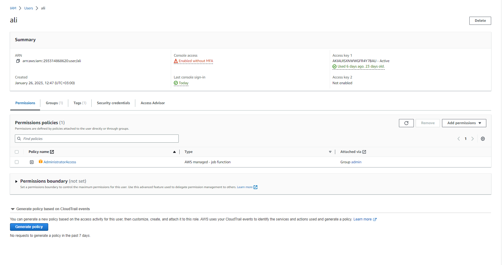
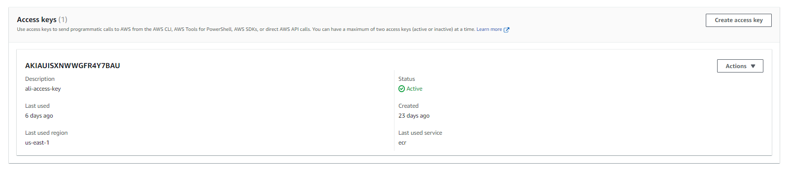
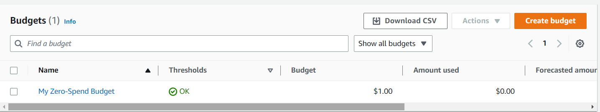
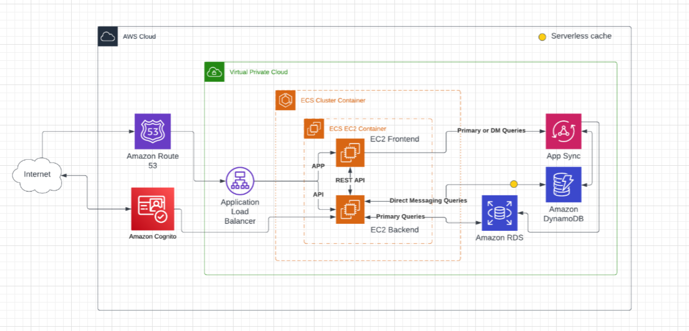

# Week 0 — Billing and Architecture

### Watch videos
- [Week 0 - Livestream](https://www.youtube.com/watch?v=SG8blanhAOg&list=PLBfufR7vyJJ7k25byhRXJldB5AiwgNnWv&index=12) 
- [Week 0 - Spend Considerations](https://www.youtube.com/watch?v=OVw3RrlP-sI&list=PLBfufR7vyJJ7k25byhRXJldB5AiwgNnWv&index=13) 
- [Week 0 - Security Consuderations](https://www.youtube.com/watch?v=4EMWBYVggQI&list=PLBfufR7vyJJ7k25byhRXJldB5AiwgNnWv&index=15) 
  
  
### AWS inital configuration

- Create Admin User
  - Navigate to IAM
  - Add users
  - Provide a user name and enable console access (optional), click next
  - Permission options, add user to a group
  - Create group, tick AdministratorAccess Policy and click create user group
  - Tick the newly created group under user groups and click next
  - Lastly tag user for resource tracking and create user 

- Create AWS Credential keys
  - Navigate to IAM, Users, click the newly created user
  - Under the Summary, click Security credentials and scroll down to Access keys
  - Create an access key for the Command Line Interface (CLI) 

- Create AWS Budget
  - Navigate to the Billing service
  - Click Budgets from the left hand menu
  - Create a budget, use a template, monthly cost budget
  - Name the budget and enter the month usage limit
  - Finally create the budget 

### Lucid charts

- [Week 0 - Lucid charts diagram](https://lucid.app/lucidchart/edd45df6-1b19-4ed8-bb96-78bb873b25ea/edit?viewport_loc=-123%2C302%2C2348%2C1071%2C0_0&invitationId=inv_3c096964-85e4-4f33-a0b9-2ee5f39d40a4) 
